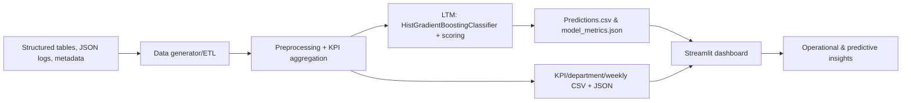

# Central Hospital Data Insights — Project Proposal & Presentation

## Project Proposal

### Vision & Goals
Central Hospital can house 5,000 patients and already operates a central EHR that stores structured tables, JSON logs, and metadata from imaging/video pipelines. The finance team is cautious about heavy IT investments, so our proposal delivers a low-footprint analytics stack that mines the hospital’s existing data for actionable insights while running entirely on the hospital’s current Python-based servers. The objectives are:

1. **Operational Intelligence** — visualize bed occupancy, ICU utilization, weekly admission trends, average length of stay, OPD share, and cost per patient to support capacity planning.
2. **Clinical Quality** — monitor readmission, complication, and mortality rates plus highlight departments with elevated issues.
3. **Predictive Risk** — score every patient using a Large Tabular Model (LTM) to detect high readmission probability and flag patients needing proactive care.
4. **Financial Visibility** — expose treatment cost averages and revenue-relevant KPIs to guide policy optimization.

### Technical Strategy & Architecture
1. **Data Generation/Ingestion** — `src/pipeline/data_generator.py` creates synthetic admissions/OPD records. The same schema can be fed with actual exports (demographics, admission metadata, financial charges, doctor notes). Everything lands in `data/raw/`.
2. **Preprocessing & KPI Aggregation** — `src/pipeline/preprocess.py` converts timestamps into weekly buckets, computes inpatient flags, cost per day, and generates KPI summaries (occupancy rate, ICU rate, readmission rate, etc.) plus department/weekly summary CSVs in `data/processed/`.
3. **Large Tabular Model (LTM)** — `src/pipeline/models.py` trains a `HistGradientBoostingClassifier`, which is the project’s LTM. It uses numeric features (age, length of stay, risk scores, cost/day, ICU/complication flags, inpatient/OPD indicators) along with categorical one-hot encoded features (department, treatment category, admission type, gender). The model predicts `predicted_readmission_prob` for each patient and stores metrics (ROC AUC, accuracy) and a serialized model for future scoring.
4. **Dashboard Delivery** — `src/dashboard/app.py` is a Streamlit app that consumes `kpi_summary.json`, `predictions.csv`, weekly trends, and department stats. It renders hero messaging, KPI cards, a sidebar risk slider, high-risk patient roster/plot, trending charts, and departmental table.
5. **Execution** — `python -m src.pipeline.run_pipeline` produces all processed artifacts; `streamlit run src/dashboard/app.py` hosts the interactive UI. Dependencies live in `requirements.txt`; tests ensure the generator and preprocessing modules run (`pytest tests`).

### Solution Architecture (LTM highlighted)

### Benefits & Budget Considerations
- Runs entirely on existing hardware; no additional cloud spending required. Optional backups or periodic model retraining can use lightweight cloud APIs if the hospital chooses to extend.
- Modular architecture lets you drop in real EHR exports, swap the LTM for a TabPFN or Hugging Face Tabular API, or containerize the Streamlit app for internal deployment.
- Outputs structured CSV/JSON files so the finance department can ingest them into other reporting tools if desired.

## LTM Model Details
- **Model**: `HistGradientBoostingClassifier` from scikit-learn.
- **Features**: Age, length of stay, treatment cost, cost per day, ICU/complication/mortality flags, risk scores, and binary indicators for inpatient/OPD plus one-hot encoded department/treatment/gender/admission type.
- **Outputs**: `predicted_readmission_prob`, `predicted_readmission_class`, and metrics (ROC AUC, accuracy). The dashboard surfaces the risk probability for clinicians.
- **Storage**: Model joblib saved under `data/processed/models/readmission_model.joblib`; predictions saved as `predictions.csv`.

## Presentation Script (Three Pupils)
Structure the presentation into three sequential roles; each pupil handles a section.

1. **Pupil 1 — Context & Vision (2 minutes)**
   - "Describe Central Hospital’s current state, 5,000-bed scale, and the need for insights without heavy IT spend."
   - "Highlight the goal of combining operations, clinical quality, finance, and prediction into one system."
   - "Briefly explain the data sources (structured tables, JSON logs, notes metadata) and how we keep the hospital’s environment local."

2. **Pupil 2 — Architecture & Pipeline (3 minutes)**
   - "Step through the pipeline: data ingestion/generation, preprocessing/KPI calculations, KPI export artifacts, and how we store department and weekly trends."
   - "Introduce the LTM: `HistGradientBoostingClassifier` trained on engineered features, producing readmission probabilities and stored metrics. Explain how this fulfills the predictive requirement."
   - "Mention the artifacts written to `data/processed/` (CSV/JSON) and how the pipeline is triggered via `python -m src.pipeline.run_pipeline`."

3. **Pupil 3 — Dashboard & Impact (3 minutes)**
   - "Show the Streamlit dashboard: hero banner, KPI cards, sidebar risk slider, high-risk roster/plot, trends, and department summary. Emphasize how each view maps back to KPIs and the predictive model."
   - "Explain how the metrics (occupancy, ICU, readmissions, treatment cost) support policy and treatment decisions."
   - "Wrap up with how minimal infrastructure was needed, tests (`pytest tests`) ensure quality, and future extensions (real data export, advanced Tabular LLMs, containerized deployment) are straightforward."

### Supporting Notes
- Mention the dashboard’s risk slider calibrates what qualifies as high risk and updates the roster/plot accordingly.
- Highlight that `st.cache_data` ensures repeated dashboard loads stay snappy.
- Emphasize the KPI definitions (occupancy rate, ICU rate, readmission, complication, mortality, avg cost) and that the `HistGradientBoostingClassifier` model is the project’s LTM.
- End by inviting stakeholders to request new KPIs or connect real exports when they decide to scale the project.
